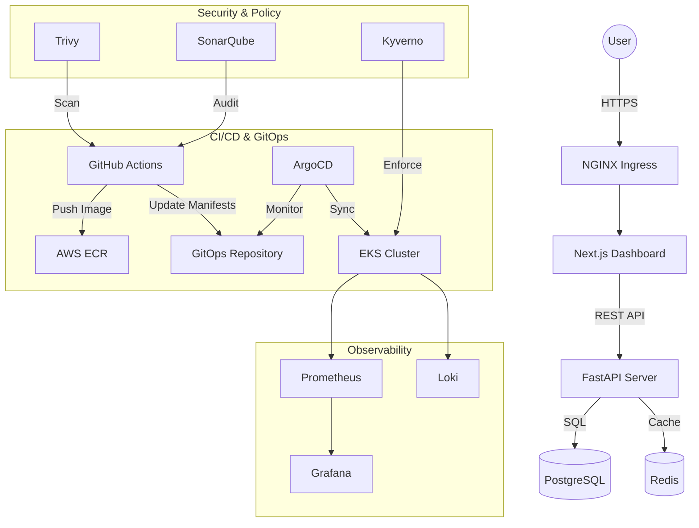

# 🚀 CloudOps Control Center — Enterprise DevOps Platform

[](docs/cicd-pipelines.md)
[](docs/security-hardening.md)
[](docs/infrastructure.md)
[](docs/gitops-orchestration.md)
[](https://opensource.org/licenses/MIT)

**CloudOps Control Center** is a state-of-the-art, production-grade DevOps and GitOps platform designed for high-scale application management, automated infrastructure provisioning, and deep observability. Built for reliability, security, and developer velocity.

---

## 📖 Table of Contents
- [✨ Key Features](#-key-features)
- [🏗️ System Architecture](#-system-architecture)
- [🛠️ Tech Stack](#-tech-stack)
- [🚀 Quick Start](#-quick-start)
- [🔄 CI/CD & GitOps Lifecycle](#-cicd--gitops-lifecycle)
- [🛡️ Security Hardening](#-security-hardening)
- [📊 Observability & Monitoring](#-observability--monitoring)
- [🌀 Advanced Rollout Strategies](#-advanced-rollout-strategies)
- [⏪ Rollback Mechanisms](#-rollback-mechanisms)
- [👤 Author](#-author)

---

## ✨ Key Features
- **Automated Infrastructure**: Full VPC, EKS, and ECR provisioning via **Terraform**.
- **Declarative GitOps**: Continuous delivery managed by **ArgoCD** using the **App-of-Apps** pattern.
- **Enterprise Security**: Automated **SAST (SonarQube)**, **DAST (OWASP ZAP)**, and **SCA (Trivy)**.
- **Zero-Downtime Rollouts**: Support for **Canary** and **Blue/Green** deployments using **Argo Rollouts**.
- **Full Observability**: Real-time metrics and logs with **Prometheus, Grafana, and Loki**.
- **Shift-Left Testing**: Integrated linting, unit testing, and security scanning in CI.

---

## 🏗️ System Architecture



---

## 🛠️ Tech Stack

| Category | Technologies |
| :--- | :--- |
| **Frontend** | Next.js 15, TypeScript, Tailwind CSS, ShadCN UI |
| **Backend** | FastAPI, Python 3.12, Pydantic v2, SQLAlchemy 2.0 |
| **Cloud** | AWS (EKS, VPC, ECR, IAM, KMS) |
| **IaC** | Terraform 1.5+ |
| **Orchestration** | Kubernetes, Helm 3, ArgoCD, Argo Rollouts |
| **Security** | Trivy, SonarQube, OWASP ZAP, Kyverno, RBAC |
| **Observability** | Prometheus, Grafana, Loki, Alertmanager |

---

## 🚀 Quick Start

### 1. Prerequisite
- AWS CLI configured with admin permissions.
- Terraform, Kubectl, and Helm installed locally.
- A GitHub Personal Access Token (PAT) for ArgoCD.

### 2. Infrastructure Deployment
```bash
cd terraform
terraform init
terraform apply -auto-approve
```

### 3. Platform Bootstrapping
```bash
chmod +x scripts/*.sh
./scripts/bootstrap.sh
```

### 4. GitOps Initialization
```bash
kubectl apply -f gitops-repo/argocd/app-of-apps.yaml
```

---

## 🔄 CI/CD & GitOps Lifecycle

### **Continuous Integration**
The `ci.yml` pipeline is triggered on every push:
1. **Code Audit**: Linting and unit tests.
2. **Security Check**: SonarQube analysis and Trivy filesystem scan.
3. **Build**: Multi-stage Docker build for production.
4. **Image Scan**: Trivy scan of the Docker image.
5. **Publish**: Push to AWS ECR.

### **Continuous Deployment**
The `cd.yml` pipeline automates the GitOps handshake:
1. Detects the new image tag.
2. Updates `values.yaml` in the GitOps repository.
3. Commits and pushes to the `CICD` branch.
4. **ArgoCD** reconciles the cluster to the new state.

---

## 🛡️ Security Hardening

- **Infrastructure**: All nodes reside in **Private Subnets**. Load Balancers are managed via **AWS ELB**.
- **Containers**: Images use **non-root users** and **read-only filesystems** where possible.
- **Admission Control**: **Kyverno** policies block privileged containers and require resource limits.
- **Secrets**: Managed via **AWS Secrets Manager** integration (Recommended: External Secrets Operator).
- **Network**: **NetworkPolicies** restrict traffic between namespaces and components.

---

## 📊 Observability & Monitoring

Our monitoring stack provides deep insights into platform health:
- **Grafana**: Pre-configured dashboards for API Latency (p95), Request Rates, and Pod Health.
- **Alertmanager**: Critical alerts routed to Slack/Email for:
  - 5xx Error Spikes (>5%)
  - API Latency (>2s)
  - Pod CrashLoopBackOffs
  - High CPU/Memory Utilization

---

## 🌀 Advanced Rollout Strategies

Toggle between strategies in your environment `values.yaml`:

### **Canary Rollout**
```yaml
backend:
  rollout:
    enabled: true
    strategy: canary
```
*Step-based traffic shifting: 20% → 5m Pause → 50% → 5m Pause → 100%.*

---

## ⏪ Rollback Mechanisms

1.  **Git Revert**: Revert commit in `CICD` branch for a clean GitOps audit trail.
2.  **Helm Rollback**: Instant cluster recovery via `scripts/rollback.sh`.
3.  **ArgoCD History**: Use the UI to "Rollback" to any historical Git SHA.

---

## 👤 Author

**Bittu Sharma**
*Senior Full Stack & DevOps Architect*
- **GitHub**: [@bittush8789](https://github.com/bittush8789)
- **LinkedIn**: [Your-LinkedIn-Profile](https://linkedin.com/in/yourprofile)

---

## 📄 License
Distributed under the MIT License. See `LICENSE` for more information.
