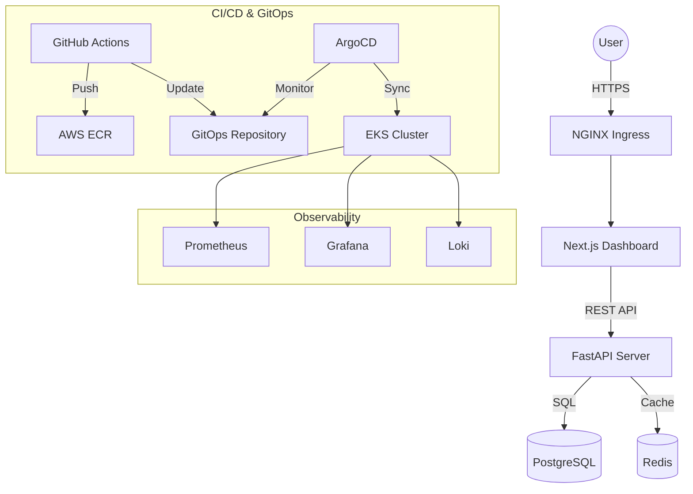

# 🚀 CloudOps Control Center — DevOps Platform

CloudOps Control Center is an enterprise-grade, production-ready DevOps and GitOps platform designed for monitoring, managing, and automating deployments at scale.

---

## 🏗️ Architecture



---

## 🛠️ Tech Stack

- **Frontend**: Next.js 15, TypeScript, Tailwind CSS, ShadCN UI.
- **Backend**: FastAPI (Python 3.12), Pydantic v2, SQLAlchemy 2.0.
- **Infrastructure**: Terraform, AWS (VPC, EKS, ECR).
- **Orchestration**: Kubernetes, Helm, ArgoCD.
- **Security**: SonarQube, OWASP ZAP, Aqua Trivy, Kyverno.
- **Observability**: Prometheus, Grafana, Loki.

---

## 🚀 Setup & Deployment Guide

### 1. Infrastructure Provisioning (Terraform)
Navigate to the `terraform/` directory and run:
```bash
terraform init
terraform plan
terraform apply
```

### 2. Platform Bootstrapping
Run the bootstrap script to prepare your cluster:
```bash
chmod +x scripts/*.sh
./scripts/bootstrap.sh
```

### 3. Local Development (Docker)
For local testing without a Kubernetes cluster:
```bash
docker compose up -d
```

---

## 🔄 CI/CD & GitOps Flow

### Continuous Integration (CI)
Our `ci.yml` workflow automatically:
1. Lints and tests code.
2. Performs **SonarQube** code quality analysis.
3. Runs **Trivy** vulnerability scans on the filesystem and Docker images.
4. Pushes production-optimized images to **AWS ECR**.

### Continuous Deployment (CD)
Our `cd.yml` workflow:
1. Bumps image tags in the `gitops-repo/helm` values.
2. Commits changes to the `CICD` branch.
3. **ArgoCD** detects the change and synchronizes the cluster state.

### Promotion Flow
To promote a build from `dev` to `prod`:
```bash
./scripts/promote.sh dev prod
```

---

## 🐙 ArgoCD Setup

We use the **App-of-Apps** pattern. To deploy the root application:
```bash
kubectl apply -f gitops-repo/argocd/app-of-apps.yaml
```
ArgoCD will automatically manage:
- Namespaces & Projects.
- Environment-specific Applications (Dev, QA, Prod).
- Security Policies.

---

## 🔍 Observability

| Tool | URL | Description |
|------|-----|-------------|
| **Grafana** | `http://grafana.local` | Custom dashboards for API latency and error rates. |
| **Prometheus** | `http://prometheus.local` | Real-time metrics and alerting. |
| **Loki** | `Integrated in Grafana` | Centralized log aggregation. |

---

## 🛡️ Security Strategy

- **Static Analysis**: SonarQube quality gates.
- **Dynamic Scanning**: OWASP ZAP baseline scans for API and UI.
- **SCA/Image Scan**: Trivy integration in every CI pipeline.
- **RBAC**: Fine-grained access control for Viewers and Developers.
- **Admission Control**: Kyverno policies enforcing non-root users.

---

## ⏪ Rollback Guide

### Manual Rollback (Helm)
If a deployment fails, use the rollback script:
```bash
./scripts/rollback.sh prod
```

### GitOps Rollback
Revert the last commit in the `CICD` branch, and ArgoCD will automatically roll back the cluster state.

---

## ❓ Troubleshooting

- **CrashLoopBackOff**: Check logs using `kubectl logs -f <pod-name> -n cloudops-prod`.
- **Database Connection**: Ensure the `postgres` service is healthy and credentials in `Secrets` are correct.
- **ArgoCD OutOfSync**: Check for manual cluster changes or invalid Helm values.

---

## 👤 Author
**Bittu Sharma** — Senior Full Stack & DevOps Architect
